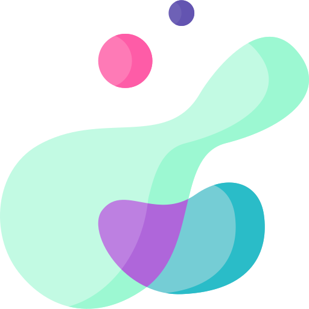

<h1 align="center">
  
  <div align="center">Azathoth</div>
</h1>

<div align="center">

<!-- CORE BADGES -->
[](https://github.com/Yrrrrrf/Azathoth)
[](./LICENSE)
[](https://github.com/Yrrrrrf/Azathoth/releases)

<!-- Rust based projects -->
[](https://crates.io/crates/azathoth)
[](https://crates.io/crates/azathoth)
[](https://docs.rs/azathoth)

<!-- Python based projects -->
<!-- [](https://pypi.org/project/mcp-py/)
[](https://pypi.org/project/mcp-py/) -->

</div>

> My personal AI architect and development partner, designed to enforce high-level coding standards and automate complex workflows.

Azathoth is not just a tool; it's an opinionated AI agent framework. It serves as a collection of specialized MCP (Master Control Program) servers that encapsulate a specific, high-level development philosophy.

> **Note:** Azathoth is the production-ready assistant, ensuring that every piece of code and every workflow adheres to predefined best practices and personal standards.

## 🚦 Getting Started

### Installation

This project is a workspace containing multiple components.

For Python dependencies:

```sh
uv sync
```

For Rust dependencies:

```sh
cargo build --release
```

### Quick Start

The Azathoth project provides a suite of tools and servers that can be integrated with any MCP-compatible AI agent or CLI:

1.  **`azathoth`**: The main binary of the project.
2.  **`mcp_py`**: A Python implementation of an MCP client, with the following scripts:
    *   **`scout`**: An intelligent agent that can explore a codebase and generate a comprehensive report.
    *   **`workflow`**: Automate common Git tasks with AI-powered context.
3.  **`mcp_rs`**: A Rust implementation of an MCP client, with examples like:
    *   **`directives`**: Configure the core behavior of your AI assistant on the fly.

To run the python scripts:
```sh
mcpy-py
scout
workflow
```

To run the rust examples from the `mcp_rs` package:
```sh
cargo run --package mcp-rs --example <example_name>
```

## 📄 License

This project is licensed under the **MIT License**. See the [LICENSE](./LICENSE) file for details.